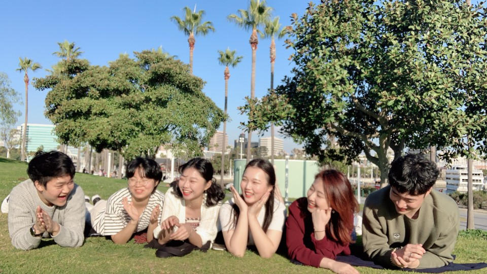
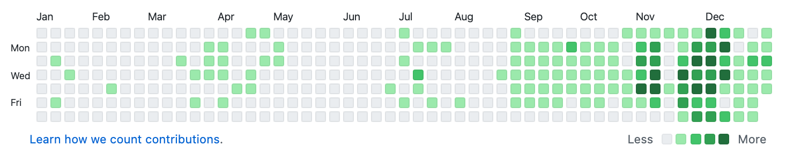

2020년은 많은 것에 도전하고 경험하면서 개발자로서 성장을 이룰 수 있었던 한 해였습니다. 그래서 더 늦기 전에 경험한 것들을 잊어버리지 않도록 간단하게나마 정리해보려고 합니다. 기술적인 내용보다는 개인적인 감상을 담은 부족한 글이지만 2021년에 블로그를 열심히 하겠다는 다짐으로 용기내어 첫 글을 올려봅니다 ☺️

## 미국에서 시작한 새 해

PeopleSpace에서 진행하는 AI 단기 연수 프로그램(~~라고 쓰고 대학생 수학여행이라 읽는다~~)에 선발되어 캘리포니아 어바인으로 떠났다 ✈ 운이 좋게도 정말 좋은 사람들과 같은 숙소에 지내게 되면서 2달 동안 너무 행복한 시간을 보냈다. 평일에는 PeopleSpace에서 AI 수업 듣고 프로젝트하고 저녁엔 같이 장보고 요리해먹고 주말이나 break 기간에는 LA, 샌프란시스코, 뉴욕으로 여행도 가보고 주말에는 맑은 날씨를 즐기며 조깅하고 숙소 사람들과 놀러다녔다. (이때로 되돌아가고 싶다..) 이때 진행한 프로젝트는 인물 사진에서 배경을 제거하고 인물만을 뽑아내는 모델을 만들고 웹 서비스로 배포까지 하는 것이었는데, 처음으로 서버를 담당해서 flask로 간단하게 테스트하는 API를 구현했는데 꽤 재밌었다. 이 프로젝트를 계기로 웹 개발에 흥미를 더 갖게 되었던 것 같다.

## 첫 인턴 생활

한국으로 귀국한 지 일주일 후에 바로 학교 현장실습연계로 한국어 교육 서비스를 개발하는 스타트업 미리내에서 일하게 되었다. 머신러닝(NLP)+웹 개발 모두 경험해볼 수 있고, 무엇보다 언어에 관심이 많은 나에게 맞는 서비스라고 생각했다. 무엇보다 개발 경력 50년이라는 CTO John Wainright가 계셔서 많이 배울 수 있을 것 같아 지원했다. 3월 동안은 거의 React.js, Node.js를 공부하고 개발과는 무관한 일을 조금 하다가 4월부터는 웹 개발에 뛰어들게 되었다. 첫 업무는 서버에서 로컬, 소셜 로그인 기능을 구현하는 것이었는데 Node.js도 koa.js도 인증 라이브러리인 passport.js도 세션과 쿠키 개념도 다 낯선 상태에서 책보고 구글링하고 문서보면서 공부하고 어떻게든 개발할 수 있었다. 나름 인턴 일지도 써가면서 그날 그날 배웠던 개념이나 했던 일들을 정리했다.~~(일지는 노트북 포맷으로 사라져버렸다)~~. 이제 koa.js와 조금 친해져갈 때 즈음 클라이언트 업무를 받게 되었다. React.js로 로그인 페이지 구현하기. 프론트엔드 시니어 개발자가 계셔서 작성해주신 좋은 코드를 보고 많이 참고할 수 있었다. 중간에 cors로 많은 삽질을 하기도 했지만 내가 개발한 API를 이용해서 기능을 하는 페이지를 구현하고 나니 많이 뿌듯했다. 풀스택 개발의 시작이 되었던 소중한 인턴 경험이었다.

## 부스트캠프

4개월의 인턴을 끝내고 계속 스타트업에서 일을 할지 아니면 취업 준비를 할지 부스트캠프에 지원을 할 지 고민했었다. 웹 개발자로서 더 공부해보고 싶다는 생각이 들었고 5개월이라는 시간이 길지만 부스트캠프에 투자했을 때 그만큼의 가치를 얻을 수 있을 거란 생각이 들어 결국 지원했고 2번의 코딩 테스트 끝에 다행히 합격할 수 있었다.

부스트캠프로 5개월동안 열심히 달려왔고 정말 많은 걸 배우고 느꼈지만 그동안 개인적으로 회고 글을 작성하지 않아 한번에 돌아보고 쓰려니 뭐부터 써야할지 모르겠다. (기록을 부지런하게 하자!) 부스트캠프를 통해 웹 지식도 얻고 풀스택으로 프로젝트 경험도 쌓고 얻은 것이 참 많지만 그중 가장 큰 것은 아무래도 끈기가 아닐까 싶다. 매일 주어진 과제를 해야했던 챌린지 과정에서나 개인, 그룹 프로젝트를 진행하면서 나의 부족함을 깨달을 때가 많았고 훌륭한 캠퍼들을 보며 부족한 자신을 자책할 때도 많았다. 그럼에도 불구하고 포기하지 않고 하루하루 최선을 다할 것. 남과 비교하지 말고 어제의 자신, 일주일 전의 자신과 비교하여 얼마나 나아졌는지를 보라고 마스터님이 말씀해주셨다. 나는 부스트캠프를 하기 전보다 구현하기에 앞서 설계를 하고, 클린한 코드를 작성하려고 노력하고, 코드 리뷰를 좋아하고, 꾸준히 배우고자 하는 사람이 되었다. 아직도 부족한 점이 많지만 꾸준함의 힘을 믿으며 성장하는 사람이 되고 싶다.

## 마치며

2020년은 쉴 틈없이 쭈욱 달려왔다는 생각이 든다. 많이 지치고 힘들기도 했지만 그만큼 성장했다고 생각하면 뿌듯하기도 하다. 무엇보다 잔디밭으로 채워진 내 깃헙 프로필을 보면 매우 뿌듯하다. 요즘은 취업 준비로 바쁘고 불안한 상태이지만 그동안 내가 해왔던 것들, 공부한 것들을 생각하면서 자신감을 갖고 앞으로도 꾸준히 성장하고 공부하는 사람이 되고 싶다. 2021년은 취업에 성공해서 여유를 갖고 더 즐기는 마음으로 공부할 수 있었으면 좋겠다.

 
